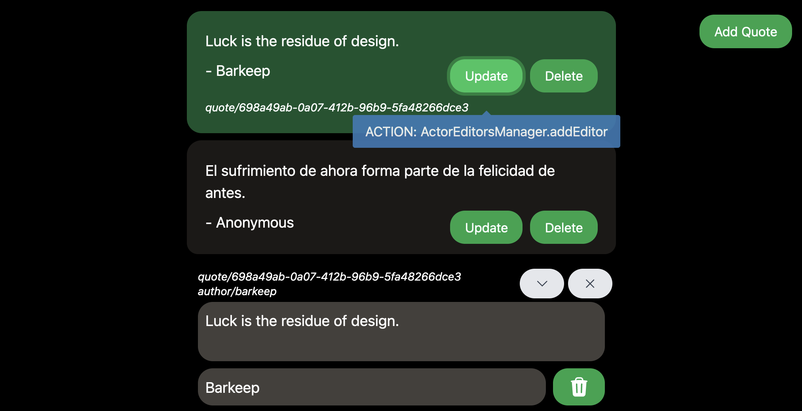

# Tarant React Hook

A React hook library designed to seamlessly integrate [Tarant](https://github.com/guillempuche/tarant), an actor model library, into React applications. This library provides hooks and utilities to manage actor lifecycle and state within React components, facilitating the development of reactive and scalable applications with the actor model pattern.

## Features

- **React Materializer**: A custom materializer for integrating Tarant actors with React, managing actor lifecycle and state updates.
- **useActor Hook**: A React hook to subscribe to Tarant actor states and re-render components upon state changes.

## Installation

To install `tarant-react-hook`, add it to your project using npm or yarn:

```bash
npm install tarant-react-hook
# or
yarn add tarant-react-hook
```

Ensure that you have `tarant` and React 18 or higher installed in your project as they are peer dependencies of this library.

## Usage

### Setting up the React Materializer

First, initialize your Tarant actor system with the `ReactMaterializer`:

```typescript
import { ActorSystem } from 'tarant';
import { ReactMaterializer } from 'tarant-react-hook';

const actorSystem = ActorSystem.for(
  ActorSystemConfigurationBuilder.define()
    .withMaterializers([new ReactMaterializer()])
    .done()
)

export const myActor = actorSystem.actorOf(MyActor, {
	args...
});
```

### Using the `useActor` Hook

Use the `useActor` hook to manage actor states in your components:

```tsx
import React from 'react';
import { useActor } from 'tarant-react-hook';
import { myActor } from './actors';

const MyComponent = () => {
  const myActorState = useActor(myActor, { debug: true});

  return <div>{myActorState.fieldA}</div>;
};
```

## Example

For a comprehensive example, check out the [Library of Text Quotes example](https://github.com/guillempuche/tarant-react/blob/main/examples/library_of_text_quotes/) which demonstrates how to use `tarant-react-hook` to build a simple application.

Try it here on this [CodeSandbox](https://fg32c4-3000.csb.app/).



## Contributing

Contributions, issues, and feature requests are welcome! Feel free to check [issues page](https://github.com/guillempuche/tarant-react/issues).

## License

`tarant-react-hook` is [MIT licensed](https://github.com/guillempuche/tarant-react/blob/main/LICENSE).